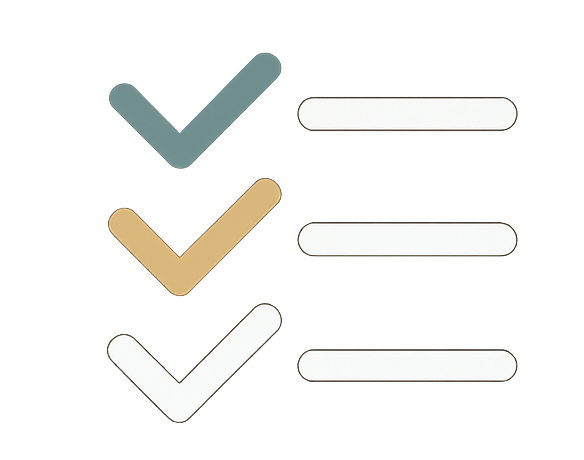

# Task Manager UI

This is the frontend UI for the Task Manager/list project

once pulled down go into the main directory (tasklist-ui)

open terminal/command line -> npm install, -> npm run dev

Should run on port http://localhost::5173 - the Api should be running on https://localhost:7082

Once the backed has been started - the system has a user already setup to demo and play with, or you can register a new user to try from scratch. 

The details for the test user are hard coded into the login page and will be visible when you navigate there

